# 🔄 Pipeline CI/CD - StockTrack360

## Diagrama del Pipeline

```mermaid
graph LR
    A["📝 Developer<br/>Commit Code"] --> B["🔀 Git Push<br/>to Branch"]
    B --> C{{"Check<br/>Branch"}}
    
    C -->|Feature Branch| D["🔍 Lint & Format<br/>ESLint"]
    C -->|Main/Pre-Main| E["🏗️ Build<br/>Next.js Build"]
    
    D --> F{{"Tests<br/>Pass?"}}
    E --> G{{"Build<br/>Success?"}}
    
    F -->|✅ Yes| H["🧪 Run Unit Tests<br/>Jest/Vitest"]
    F -->|❌ No| I["⚠️ Notify Developer<br/>Fix Linting"]
    
    G -->|✅ Yes| J["📦 Build Artifacts<br/>Create Bundle"]
    G -->|❌ No| K["⚠️ Notify Developer<br/>Fix Build"]
    
    H --> L{{"All Tests<br/>Pass?"}}
    L -->|✅ Yes| M["📝 Create PR<br/>for Code Review"]
    L -->|❌ No| N["⚠️ Fix Tests<br/>and Retry"]
    
    M --> O["👀 Code Review<br/>Team Approval"]
    J --> O
    
    O -->|✅ Approved| P["✅ Merge to Main"]
    O -->|❌ Changes Needed| Q["🔄 Return to Dev<br/>Make Changes"]
    
    Q --> B
    
    P --> R["🚀 Deploy to Staging<br/>Vercel/Server"]
    R --> S["🧪 Integration Tests<br/>E2E Tests"]
    
    S -->|✅ Pass| T["📊 Smoke Tests<br/>Health Checks"]
    S -->|❌ Fail| U["⚠️ Rollback<br/>Notify Team"]
    
    T -->|✅ All Green| V["🎉 Deploy to Production<br/>Live Release"]
    T -->|❌ Fail| U
    
    V --> W["📈 Monitor<br/>Logs & Metrics"]
    W --> X["✨ Success!<br/>Release Complete"]
    
    style A fill:#e1f5ff
    style V fill:#c8e6c9
    style X fill:#a5d6a7
    style I fill:#ffccbc
    style K fill:#ffccbc
    style N fill:#ffccbc
    style U fill:#ef9a9a
```



---

## 📋 Etapas del Pipeline

### 1️⃣ **Trigger (Activación)**
- Developer hace commit y push
- Se verifica si es rama feature o main
- Se inicia automáticamente el pipeline

### 2️⃣ **Linting (Análisis de código)**
- ESLint valida formato y estilo
- Si falla, se notifica al desarrollador
- Debe corregir antes de continuar

### 3️⃣ **Build (Compilación)**
- Next.js compila el proyecto
- Genera bundles optimizados
- Si falla, se notifica del error

### 4️⃣ **Testing (Pruebas)**
- Unit tests validar lógica
- Tests de integración
- Cobertura mínima 70%
- Si alguno falla, se detiene el pipeline

### 5️⃣ **Code Review**
- Aprobación manual del equipo
- Se valida lógica y buenas prácticas
- Si es rechazado, vuelve a desarrollo

### 6️⃣ **Merge**
- Se hace merge a rama main
- Se crea tag de versión
- Se dispara deployment

### 7️⃣ **Staging Deployment**
- Se despliega a ambiente de staging
- Se ejecutan tests E2E
- Se hacen pruebas de integración

### 8️⃣ **Smoke Tests**
- Validaciones básicas
- Health checks
- Verificación de endpoints críticos

### 9️⃣ **Production Deploy**
- Release a ambiente de producción
- Usuarios finales acceden al sistema
- Se monitorean logs y métricas

### 🔟 **Monitoring**
- Vigilancia continua de performance
- Alertas en caso de errores
- Reportes de uso y estabilidad

---

## 🔴 Puntos de Control (Gates)

| Gate | Descripción | Acción si Falla |
|------|-------------|-----------------|
| **Lint** | Validación de código | Notificar dev, bloquear merge |
| **Build** | Compilación exitosa | Notificar dev, bloquear merge |
| **Tests** | Tests pasan | Notificar dev, bloquear merge |
| **Coverage** | Cobertura > 70% | Bloquear merge |
| **Code Review** | Aprobación equipo | Esperar aprobación |
| **E2E Tests** | Tests de integración | Rollback automático |
| **Smoke Tests** | Health checks | Rollback automático |

---

## 🛠️ Herramientas Utilizadas

| Herramienta | Propósito | Descripción |
|------------|----------|------------|
| **GitHub Actions** | CI/CD Automation | Automatización del pipeline |
| **Next.js** | Build & Runtime | Framework principal |
| **ESLint** | Linting | Análisis de código |
| **Jest** | Unit Testing | Tests unitarios |
| **Cypress/Playwright** | E2E Testing | Tests de integración |
| **Vercel/Server** | Hosting | Deployment en staging/prod |
| **DataDog/LogRocket** | Monitoring | Observabilidad |

---

## 🚦 Rama Strategy

### Development Flow
```
feature/nombre → PR → Code Review → ✅ Approved → Merge to main
```

### Branches Principales
- **main**: Código en producción
- **pre-main**: Código previo a producción (staging)
- **develop**: Rama de desarrollo
- **feature/\***: Features en desarrollo
- **hotfix/\***: Correcciones urgentes

---

## ⏱️ Tiempos Aproximados

| Etapa | Tiempo |
|-------|--------|
| Linting | 1-2 min |
| Build | 3-5 min |
| Tests | 5-10 min |
| Code Review | 15-30 min (manual) |
| Staging Deploy | 2-3 min |
| E2E Tests | 5-10 min |
| Production Deploy | 2-3 min |
| **Total** | **30-60 min** |

---

## 📊 Métricas Monitoreadas

- ✅ Build success rate
- ✅ Test pass rate
- ✅ Code coverage
- ✅ Deployment frequency
- ✅ Lead time for changes
- ✅ Mean time to recovery (MTTR)
- ✅ Application uptime

